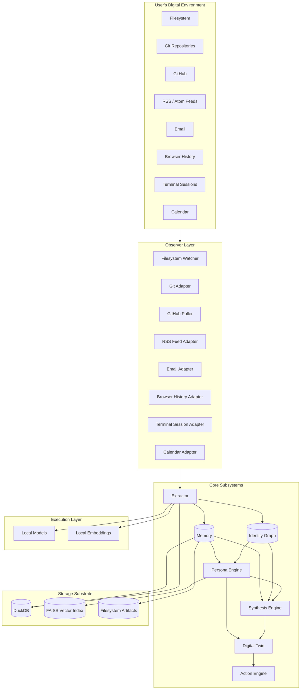

# SELF

## Synthetic Evolutionary Local Framework

> A local-first intelligence infrastructure that continuously synthesizes a user's digital existence into a persistent, evolving cognitive model.

---

## Project Vision

SELF is a continuously operating, local-first cognitive infrastructure that observes, remembers, and synthesizes a user's digital activity into a persistent and evolving model of who they are. It is not a chatbot. It is not a personal assistant in the conventional sense. It is a long-running, self-updating representation of a human being that emerges from observation, memory, synthesis, and action.

The system treats the user as a process — not a prompt. The system is designed to run for years, not sessions. Every interaction the user has with their digital environment becomes raw material for an evolving identity model. Over time, the system develops a representation of the user that is rich enough to:

- Predict what the user is likely to do next.
- Retrieve knowledge the user has previously synthesized.
- Detect when the user's beliefs, goals, or projects have changed.
- Act on the user's behalf through an execution layer.
- Reflect back a coherent narrative of who the user has become.

SELF is **infrastructure for personal continuity**.

---

## Goals

The goals of SELF, in priority order, are:

1. **Continuity** — Maintain an unbroken, evolving representation of the user across years, sessions, devices, and modalities.
2. **Locality** — Operate entirely on the user's own hardware. No data leaves the user's machine unless the user explicitly authorizes it.
3. **Auditability** — Every inference, every memory, every state change must be traceable to a source observation.
4. **Explainability** — The system must be able to justify why it believes what it believes.
5. **Provenance** — Every knowledge object must carry its lineage back to the events that produced it.
6. **Model Independence** — The system must survive changes in the underlying language models, embedding models, and storage systems.
7. **Composability** — Every subsystem must be replaceable, swappable, and inspectable.
8. **Autonomy with Consent** — The system may act, but only with explicit, revocable permission.

---

## Philosophy

SELF is built on a small set of philosophical commitments that constrain every design decision:

### The model is not the intelligence.

A language model is a reasoning engine. It is not a memory. It is not an identity. The intelligence of SELF emerges from the interaction between the model and the structured state that surrounds it: memory, observations, identity graph, persona vectors, knowledge objects, and the history of actions taken. Strip the model away and replace it with another, and SELF continues. Strip the state away and SELF is empty.

### Memory is the substrate of identity.

A person is not a frozen snapshot. A person is the accumulation of experiences, beliefs, projects, relationships, and changes. SELF models identity as a temporal graph that evolves through observation. The system remembers what the user did, what they believed, what they were working on, and who they were connected to — and how all of that has changed.

### Observation is continuous, but synthesis is deliberate.

SELF observes everything the user produces. It synthesizes deliberately, on schedules, and on demand. The observation layer is always running. The synthesis layer wakes up at meaningful moments: end of day, end of week, on a milestone, on a request. This separation prevents the system from drowning the user in real-time narration.

### Local-first is a moral position, not just a technical one.

Personal cognitive infrastructure should not require the user to surrender their data, their identity, or their narrative to a third party. SELF is designed to be inspectable, replaceable, and owned by the user in the deepest sense: the user can read the data, modify the data, delete the data, and migrate the data.

### The system is a tool, not a partner.

SELF may take action, but it does not have agency in the human sense. It does not have feelings, preferences, or goals of its own. It is an instrument the user wields to extend their own cognitive reach. Any anthropomorphization is a UI choice, not a system property.

### Continuity over cleverness.

A simple system that runs every day for five years is more valuable than a brilliant system that runs once. SELF optimizes for durability, observability, and recoverability over novelty and complexity.

---

## System Overview

SELF is composed of nine primary subsystems that work together in a continuous loop:

| Subsystem | Role |
| --- | --- |
| **Observer** | Captures raw events from the user's digital environment. |
| **Extractor** | Transforms raw events into structured knowledge objects. |
| **Memory** | Stores events, knowledge, and derived state across time. |
| **Identity Graph** | Maintains a temporal graph of entities, relationships, and changes. |
| **Persona Engine** | Maintains a vector representation of the user's evolving identity. |
| **Digital Twin** | Provides a queryable, conversational interface to the identity model. |
| **Action Engine** | Executes actions on the user's behalf through an execution layer. |
| **Synthesis Engine** | Produces summaries, reflections, and predictions on schedules and demand. |
| **Orchestration** | Coordinates all subsystems across continuous time. |

These subsystems are bound together by:

- A **storage substrate** (DuckDB for analytical state, vector database for semantic retrieval, filesystem for raw artifacts).
- A **provenance layer** that records the lineage of every knowledge object.
- A **security model** that enforces user ownership, consent, and auditability.
- An **interface layer** that adapts to the various systems SELF observes (filesystem, git, GitHub, RSS, email, browser, terminal, calendar).

---

## Architecture Diagram



The loop runs continuously. Observation produces events. Extraction produces knowledge. Memory and the identity graph accumulate state. The persona engine and synthesis engine update the user's evolving representation. The digital twin exposes the representation to the user. The action engine, when authorized, acts on the world.

---

## Repository Structure

```
SELF/
├── README.md                   # This file
├── TODO.md                     # Implementation task tracking
├── architecture/               # Subsystem architecture documents
├── evaluations/                # Evaluation specifications
├── src/self/                   # Implementation code
│   ├── source_adapters/        # 8 adapters (Filesystem, Git, GitHub, RSS, Email, Browser, Terminal, Calendar)
│   ├── orchestrator/           # Scheduling, retry, main loop
│   ├── persona_engine/         # Vector store, embeddings, updater, predictor
│   ├── identity_graph/         # Temporal entity model
│   ├── digital_twin/           # Conversational interface
│   ├── synthesis_engine/       # Summaries and narratives
│   ├── action_engine/          # World side-effects
│   ├── evaluation/             # Evaluation framework
│   └── security/               # Authentication, authorization, secrets
├── tests/                      # 325 unit tests
└── prompts/                    # Prompt specifications
```

---

## Current Status

| Area | Status |
|------|--------|
| Foundation (Phase 1) | ~95% — 12 DB tables, 16 schema validators, startup integrity verification |
| Observation (Phase 2) | ~100% — Normalizer, IngestQueue, 8 adapters |
| Extraction (Phase 3) | ~100% — ModelClient, PromptLibrary, Validator, Batcher, Writer, ConfidenceScorer, ContradictionDetector |
| Memory (Phase 4) | ~90% — MemoryAPI, Snapshots, Compaction, Retention, Exporter |
| Identity Graph (Phase 5) | ~95% — All 9 modules |
| Persona Engine (Phase 6) | ~100% — VectorStore, Embeddings, Updater, Scorer, DecayEngine, Predictor, ModelAdapter |
| Digital Twin (Phase 7) | ~100% — All 9 components including QueryDecomposer |
| Action Engine (Phase 8) | ~100% — All 9 components, 3 capabilities, SandboxManager |
| Synthesis Engine (Phase 9) | ~100% — All 7 components, 4 summary types, SummaryScheduler |
| Orchestration | ~100% — Scheduler, Retry, Main Loop, Pipeline |
| Security | ~100% — Auth, Authorization, Secrets, Injection, Sandbox |
| Evaluations | ~100% — Runner, Ground Truth, Report Generator |

**325 tests passing**, ruff clean, mypy clean across 130+ source files.

---

## Quick Start

### Prerequisites

- Python 3.14+
- Ollama (for local model serving)

### Installation

```bash
# Clone the repository
git clone https://github.com/your-username/self.git
cd self

# Create virtual environment
python -m venv .venv
source .venv/bin/activate

# Install dependencies
pip install -e .

# Run tests
python -m pytest tests/ -v

# Start the system
python -m self
```

### Running Tests

```bash
# Run all tests
python -m pytest tests/ -v

# Run with coverage
python -m pytest tests/ --cov=self

# Run linting
ruff check .
ruff format --check .
mypy src/self/
```

---

## Configuration

SELF uses a YAML configuration file located at `~/.config/self/config.yaml`. See `src/self/config.py` for available options.

---

## Architecture

SELF follows a 10-phase implementation plan:

1. **Foundation** — Scaffolding, storage, observability primitives
2. **Observation** — Capture events from user's digital environment
3. **Extraction** — Transform events into structured knowledge
4. **Memory** — Persistent storage substrate
5. **Identity Graph** — Temporal entity model
6. **Persona Engine** — Vector representation of identity
7. **Digital Twin** — Conversational interface
8. **Action Engine** — Execute actions on user's behalf
9. **Synthesis** — Summaries, reflections, predictions
10. **Autonomy** — Self-assessment and capability discovery

---

## Source Adapters

SELF currently supports 8 source adapters for observing the user's digital environment:

| Adapter | Description |
|---------|-------------|
| `FilesystemWatcher` | Monitors directories for file changes |
| `GitPollingAdapter` | Tracks git repository activity |
| `GitHubPoller` | Monitors GitHub repos (issues, PRs, commits) |
| `RSSFeedAdapter` | Polls RSS/Atom feeds for new entries |
| `EmailAdapter` | Monitors email folders for new messages |
| `BrowserHistoryAdapter` | Tracks browser history |
| `TerminalSessionAdapter` | Monitors terminal commands |
| `CalendarAdapter` | Tracks calendar events |

---

## License

SELF is intended to be released under a license that preserves user ownership of all generated state. See `decisions/` for license-related ADRs. Until a license is formally adopted, the project is "all rights reserved" to its contributors, with the explicit understanding that the project aims to be open source.

---

## Contributing

Contributions begin with documentation. Code contributions are gated on documentation completeness. See `BUILDING.md` for the full process.

### Development Workflow

1. Fork the repository
2. Create a feature branch
3. Write tests for new functionality
4. Ensure all tests pass: `python -m pytest tests/ -v`
5. Run linting: `ruff check . && mypy src/self/`
6. Submit a pull request

---

## Contact

For questions, issues, or contributions, please open an issue on GitHub.
