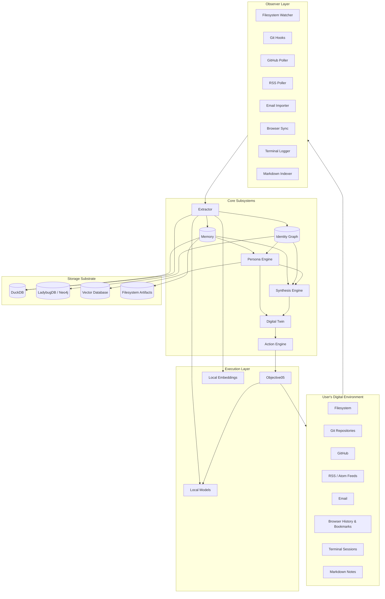

# SELF

## Synthetic Evolutionary Local Framework

> A local-first intelligence infrastructure that continuously synthesizes a user's digital existence into a persistent, evolving cognitive model.

---

## Project Vision

SELF is a continuously operating, local-first cognitive infrastructure that observes, remembers, and synthesizes a user's digital activity into a persistent and evolving model of who they are. It is not a chatbot. It is not a personal assistant in the conventional sense. It is a long-running, self-updating representation of a human being that emerges from observation, memory, synthesis, and action.

The system treats the user as a process — not a prompt. The system is designed to run for years, not sessions. Every interaction the user has with their digital environment becomes raw material for an evolving identity model. Over time, the system develops a representation of the user that is rich enough to:

- Predict what the user is likely to do next.
- Retrieve knowledge the user has previously synthesized.
- Detect when the user's beliefs, goals, or projects have changed.
- Act on the user's behalf through an execution layer.
- Reflect back a coherent narrative of who the user has become.

SELF is **infrastructure for personal continuity**.

---

## Goals

The goals of SELF, in priority order, are:

1. **Continuity** — Maintain an unbroken, evolving representation of the user across years, sessions, devices, and modalities.
2. **Locality** — Operate entirely on the user's own hardware. No data leaves the user's machine unless the user explicitly authorizes it.
3. **Auditability** — Every inference, every memory, every state change must be traceable to a source observation.
4. **Explainability** — The system must be able to justify why it believes what it believes.
5. **Provenance** — Every knowledge object must carry its lineage back to the events that produced it.
6. **Model Independence** — The system must survive changes in the underlying language models, embedding models, and storage systems.
7. **Composability** — Every subsystem must be replaceable, swappable, and inspectable.
8. **Autonomy with Consent** — The system may act, but only with explicit, revocable permission.

---

## Philosophy

SELF is built on a small set of philosophical commitments that constrain every design decision:

### The model is not the intelligence.

A language model is a reasoning engine. It is not a memory. It is not an identity. The intelligence of SELF emerges from the interaction between the model and the structured state that surrounds it: memory, observations, identity graph, persona vectors, knowledge objects, and the history of actions taken. Strip the model away and replace it with another, and SELF continues. Strip the state away and SELF is empty.

### Memory is the substrate of identity.

A person is not a frozen snapshot. A person is the accumulation of experiences, beliefs, projects, relationships, and changes. SELF models identity as a temporal graph that evolves through observation. The system remembers what the user did, what they believed, what they were working on, and who they were connected to — and how all of that has changed.

### Observation is continuous, but synthesis is deliberate.

SELF observes everything the user produces. It synthesizes deliberately, on schedules, and on demand. The observation layer is always running. The synthesis layer wakes up at meaningful moments: end of day, end of week, on a milestone, on a request. This separation prevents the system from drowning the user in real-time narration.

### Local-first is a moral position, not just a technical one.

Personal cognitive infrastructure should not require the user to surrender their data, their identity, or their narrative to a third party. SELF is designed to be inspectable, replaceable, and owned by the user in the deepest sense: the user can read the data, modify the data, delete the data, and migrate the data.

### The system is a tool, not a partner.

SELF may take action, but it does not have agency in the human sense. It does not have feelings, preferences, or goals of its own. It is an instrument the user wields to extend their own cognitive reach. Any anthropomorphization is a UI choice, not a system property.

### Continuity over cleverness.

A simple system that runs every day for five years is more valuable than a brilliant system that runs once. SELF optimizes for durability, observability, and recoverability over novelty and complexity.

---

## System Overview

SELF is composed of nine primary subsystems that work together in a continuous loop:

| Subsystem | Role |
| --- | --- |
| **Observer** | Captures raw events from the user's digital environment. |
| **Extractor** | Transforms raw events into structured knowledge objects. |
| **Memory** | Stores events, knowledge, and derived state across time. |
| **Identity Graph** | Maintains a temporal graph of entities, relationships, and changes. |
| **Persona Engine** | Maintains a vector representation of the user's evolving identity. |
| **Digital Twin** | Provides a queryable, conversational interface to the identity model. |
| **Action Engine** | Executes actions on the user's behalf through Objective05-style layers. |
| **Synthesis Engine** | Produces summaries, reflections, and predictions on schedules and demand. |
| **Orchestration** | Coordinates all subsystems across continuous time. |

These subsystems are bound together by:

- A **storage substrate** (DuckDB for analytical state, LadybugDB (or compatible Kuzu-successor) or Neo4j for graph state, vector database for semantic retrieval, filesystem for raw artifacts).
- A **provenance layer** that records the lineage of every knowledge object.
- A **security model** that enforces user ownership, consent, and auditability.
- An **interface layer** that adapts to the various systems SELF observes (filesystem, git, GitHub, RSS, email, browser, terminal, markdown, Objective05, local models, vector database, knowledge graph).

---

## Architecture Diagram



The loop runs continuously. Observation produces events. Extraction produces knowledge. Memory and the identity graph accumulate state. The persona engine and synthesis engine update the user's evolving representation. The digital twin exposes the representation to the user. The action engine, when authorized, acts on the world.

---

## Repository Map

This repository is documentation-first. The structure is:

```
SELF/
├── README.md                   # This file — vision, philosophy, overview
├── spec.md                     # Canonical system specification
├── BUILDING.md                 # Implementation workflow and contribution standards
├── CONSTITUTION.md             # Non-negotiable principles
├── docs/                       # Cross-cutting documentation, glossary, style
├── architecture/               # Subsystem architecture documents (one per subsystem)
├── schemas/                    # Machine-readable schema specifications
├── roadmap/                    # Phased implementation plan (10 phases)
├── evaluations/                # Evaluation specifications
├── examples/                   # End-to-end behavioral examples
├── prompts/                    # Prompt specifications (model-agnostic)
├── decisions/                  # Architecture Decision Records (ADRs)
├── interfaces/                 # Interface specifications for external systems
├── security/                   # Threat model, privacy, governance
└── src/                        # Implementation (initially minimal)
```

### Reading Order for New Contributors

1. `README.md` — what is this?
2. `CONSTITUTION.md` — what are the unbreakable rules?
3. `spec.md` — what are we actually building?
4. `architecture/` — how is it built?
5. `schemas/` — what are the data shapes?
6. `interfaces/` — what does it talk to?
7. `roadmap/` — in what order do we build it?
8. `evaluations/` — how do we know it works?
9. `examples/` — what does it look like in practice?
10. `prompts/` — how do we talk to the models?
11. `decisions/` — why did we make the choices we made?
12. `security/` — what could go wrong?
13. `BUILDING.md` — how do I contribute?

---

## Implementation Strategy

SELF is implemented in phases. The first phase is documentation. Every subsequent phase adds a subsystem or capability.

### Principles of Implementation

- **Documentation precedes code.** No subsystem is implemented before its architecture document, schema, and evaluation criteria exist.
- **Local before remote.** Every capability must work fully on the user's own machine before any external integration is considered.
- **Test against evaluations.** Subsystems are considered complete only when they pass the evaluations defined in `evaluations/`.
- **Replaceability is enforced.** Every implementation choice is wrapped behind an interface so it can be swapped without rewriting callers.
- **The data model outlives the code.** Schemas are versioned. State is portable. A new implementation can read the data of an old one.

### Build Order

| Phase | Focus | See |
| --- | --- | --- |
| 1 | Foundation: scaffolding, storage, observability primitives | `roadmap/phase_01_foundation.md` |
| 2 | Observation across local surfaces | `roadmap/phase_02_observation.md` |
| 3 | Extraction into structured knowledge | `roadmap/phase_03_extraction.md` |
| 4 | Memory substrate | `roadmap/phase_04_memory.md` |
| 5 | Identity graph | `roadmap/phase_05_identity.md` |
| 6 | Persona engine | `roadmap/phase_06_persona.md` |
| 7 | Digital twin | `roadmap/phase_07_digital_twin.md` |
| 8 | Action engine | `roadmap/phase_08_action_engine.md` |
| 9 | Continuous synthesis loop | `roadmap/phase_09_continuous_synthesis.md` |
| 10 | Autonomy and self-extension | `roadmap/phase_10_autonomy.md` |

---

## Onboarding Guide

If you are a new contributor — human or agent — start here.

### Step 1: Read the Constitution

`CONSTITUTION.md` is short and non-negotiable. If a proposed change violates a constitutional principle, the change must be rejected or the constitution must be amended through the formal amendment process.

### Step 2: Read the Specification

`spec.md` defines the system at the highest level. You should be able to summarize what SELF is, what its subsystems are, and how data flows through it after reading this document.

### Step 3: Explore the Architecture

Read each document in `architecture/`. These documents describe the responsibilities, inputs, outputs, dependencies, internal components, data contracts, failure modes, metrics, and future evolution of every subsystem.

### Step 4: Study the Schemas

The schemas in `schemas/` define the exact shape of every knowledge object SELF produces. Schema changes require version bumps.

### Step 5: Understand the Interfaces

The documents in `interfaces/` describe how SELF talks to the outside world. New interfaces follow the same template: purpose, data acquired, permissions, privacy, implementation.

### Step 6: Read the Decisions

The ADRs in `decisions/` record the architectural decisions that have been made and the rationale behind them. Read them before proposing alternatives.

### Step 7: Pick a Phase

Open `roadmap/phase_XX_*.md` for the phase you intend to work on. The phase document specifies objectives, deliverables, dependencies, risks, milestones, and acceptance criteria.

### Step 8: Build Against Evaluations

Before writing code, read the relevant evaluations in `evaluations/`. Your implementation is not complete until it passes them.

### Step 9: Follow the Build Workflow

`BUILDING.md` describes the contribution workflow, the definition of completion, the coding-agent workflow, and the standards for code, tests, and documentation.

### Step 10: Be Patient

SELF is a long-running system. You will not finish it in a week. You will not finish it in a month. You will, however, finish a phase. And then another. And over time, the system emerges.

---

## Status

This repository is in **Phase 1: Foundation**. The documentation is the system. The code will follow.

---

## License

SELF is intended to be released under a license that preserves user ownership of all generated state. See `decisions/` for license-related ADRs. Until a license is formally adopted, the project is "all rights reserved" to its contributors, with the explicit understanding that the project aims to be open source.

---

## Contact and Contribution

This is a documentation-first project. Contributions begin with documentation. Code contributions are gated on documentation completeness. See `BUILDING.md` for the full process.
